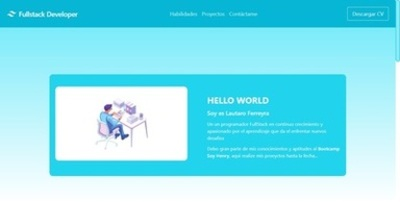
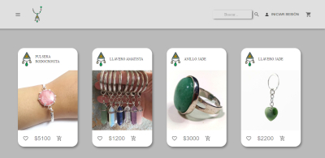
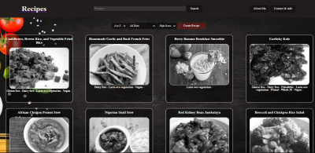

<h2 align="center">
  💻Desarrlador FullStack
</h2>

## **🧑🏾 Sobre Mi**

Me apasiona la programación, el continuo aprendizaje y enfrentarme a nuevos desafíos.

Realicé el Bootcamp de Soy Henry donde me desarrollé como programador FullStack.

Soy profesional en los proyectos a realizar, priorizando un código limpio y legible para facilitar la interacción de otra persona con el mismo.

También considero fundamentales las relaciones humanas y el trabajo en equipo para un objetivo en conjunto.

---

## **📚 Proyectos y Web**

&nbsp;

## Portfolio

 
    <h3>Portfolio realizado desde 0 aprendiendo Tailwind CSS</h3>
    Decidí realizar este proyecto para poder darme a conocer en el ámbito de la programación y poder afianzar mis conocimientos dentro del desarrollo FrontEnd.
    
La versión de este proyecto la iré actualizando a medida que adquiera nuevos conocimientos y pueda generar un aspecto más profesional y mejores funcionalidades

    
El proyecto fue realizado en una plantilla React-App, junto a tailwind y EmailJS para realizar el contacto a través de un formulario.

 
 
    <h3>Trabajo final realizado en SoyHenry. Junto a 6 grandes compañeros</h3>
    Nuestro grupo decidió utilizar la temática de piedras preciosas y los objetos que pueden realizarse con las mismas. Acá logramos afianzar nuestros conocimientos del Lenguaje aprendido durante el bootcamp. Tales como "JavaScript, React, Redux y materialUI" para el front, Y "Node.js, JavaScript, Sequelize, Postgress" del lado de Backend.
    
Tuve la posibilidad de conocer ambos mundos de la programación, pero me encontré en Backend, donde pudimos realizar implementaciones con mercado pago, Auth0 para autenticar y el control de rutas.

    
Generamos nuestra propia Base de datos, relaciones y creación de rutas para el front y la documentación de las mismas. Dándole Click a la imagen podrán tener acceso a la página del proyecto. Muchas gracias por leer!!

 

&nbsp;&nbsp;

---

## Proyecto Individual

 
    <h3>Proyecto realizado individualmente para afianzar conocimientos de Bootcamp</h3>
    Personalmente me toco trabajar con el consumo de una Api llamada "Spooncular". La misma tenia temática de recetas.
    
Personalmente me tocó trabajar con el consumo de una Api llamada "Spooncular". La misma tenía temática de recetas.

    
También cabe destacar que fue mi primer contacto con el Deploy de proyectos, ya que nunca lo había hecho y fue un gran desafío.

    
Entre los lenguajes y frameworks utilizados se puede resaltar el uso de JavaScript, React-Redux, SweetAlert, Node.js, SequelizeORM y PostgresSQL.

    
Este Proyecto fue levemente modificado una vez obtuve mayores conocimientos para darle una mejor estética y funcionamiento. 

    Dándole Click a la imagen podrán tener acceso a la página del proyecto. Muchas gracias por leer!!

 
---
&nbsp;
## **🛠 Lenguajes y Herramientas:**

|                                       |            |                               |         |                                     |           |
| ------------------------------------- | ---------- | ----------------------------- | ------- | ----------------------------------- | --------- |
|  | JavaScript |  | Node.Js |    | Postgress |
|            | React      |        | Git     |  | Sequelize |
|            | Redux      |      | HTML    |      | MongoDB   |
|                | Css        |    | Auth0   |      | Express   |

&nbsp;

---

## **📎 Como contactarme:**

- 
  
  - 📧ferreyralautaro69@gmail.com
